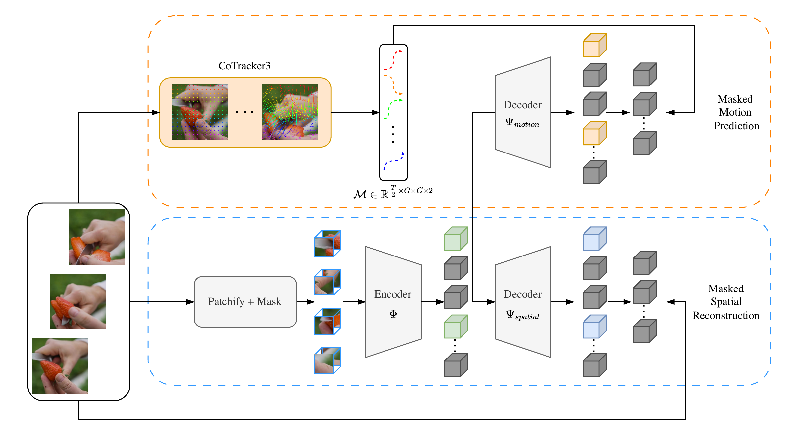

# Official PyTorch Implementation of TrackMAE (CVPR 2026)

<p align="center">
  
</p>

[](https://www.python.org/)
[](https://pytorch.org/)
[](https://huggingface.co/rvandeghen/TrackMAE)

> [**TrackMAE: Video Representation Learning via Track Mask and Predict**](https://arxiv.org/abs/2603.27268)<br>
> Renaud Vandeghen*, Fida Mohammad Thoker*, Marc Van Droogenbroeck, Bernard Ghanem<br>
> University of Liege and KAUST. *Equal contribution.

TrackMAE is a masked video modeling framework that learns motion-aware video
representations from point trajectories. It uses CoTracker3 to extract sparse
tracks, predicts their displacements as an additional masked target, and reuses
the trajectory magnitudes to construct motion-aware tube masks.

## News

**[2026.06.05]** TrackMAE code released.

## Highlights

### Explicit motion supervision from point tracks

TrackMAE tracks patch-centered query points through the input clip and predicts
their displacements at masked locations. A shared video encoder feeds two
lightweight decoders: one reconstructs spatial targets and the other predicts
motion trajectories.

### Motion-aware tube masking

The extracted trajectories also determine where visible tokens are sampled.
TrackMAE separates tokens into high- and low-motion bins and samples from both,
preventing the encoder from focusing only on static context or only on the most
dynamic regions. The paper uses `rho_motion = 50%`.

### Complementary spatial and motion targets

The motion objective complements both pixel and semantic feature reconstruction:

```text
L = L_spatial + lambda * L_motion
```

For the main ViT-B experiments, TrackMAE uses a `14 x 14` CoTracker3 query grid,
upsamples trajectories by a factor of two, and trains for 800 epochs. The paper
uses `lambda = 1.0` with pixel targets and `lambda = 0.25` with CLIP targets.

### Strong motion-aware representations

With a ViT-B backbone and CLIP reconstruction, TrackMAE reaches **72.8%** Top-1
on Something-Something V2 and **83.9%** on Kinetics-400. Under linear probing,
it reaches **27.3%** on SSv2 and **55.2%** on K400.

## Main Results and Models

The classification tables report Top-1 accuracy from the TrackMAE paper.
SEVERE uses the metric defined by each downstream task. Training-log links will
be added when the public artifacts are available.
Pretrained and fine-tuned checkpoints are available on
[Hugging Face](https://huggingface.co/rvandeghen/TrackMAE).

### Something-Something V2

| Method | Spatial Target | Pretrain Dataset | Epochs | Backbone | Top-1 | Model |
| :-- | :-- | :--: | :--: | :--: | :--: | :--: |
| TrackMAE | Pixel | K400 | 800 | ViT-B | 70.1 | TBA |
| TrackMAE | CLIP | K400 | 800 | ViT-B | **72.8** | TBA |
| TrackMAE | CLIP | SSv2 | 800 | ViT-B | 72.5 | TBA |
| TrackMAE | CLIP | K700 | 800 | ViT-L | **75.7** | TBA |

### Kinetics-400

| Method | Spatial Target | Pretrain Dataset | Epochs | Backbone | Top-1 | Model |
| :-- | :-- | :--: | :--: | :--: | :--: | :--: |
| TrackMAE | Pixel | K400 | 800 | ViT-B | 80.8 | TBA |
| TrackMAE | CLIP | K400 | 800 | ViT-B | **83.9** | TBA |
| TrackMAE | CLIP | K700 | 800 | ViT-L | **86.7** | TBA |

### Linear Probing

ViT-B encoders are pretrained on Kinetics-400 and frozen during downstream
training.

| Method | Spatial Target | K400 | SSv2 |
| :-- | :-- | :--: | :--: |
| TrackMAE | Pixel | 25.7 | 23.6 |
| TrackMAE | CLIP | **55.2** | **27.3** |

### SEVERE Generalization

SEVERE evaluates domain shift, sample efficiency, action granularity, and task
shift. Higher is better for all columns except UCF-RC, which reports mean error.

| Method | Spatial Target | SSv2 | Gym99 | UCF 1K | GYM 1K | FX-S1 | UB-S1 | UCF-RC | Charades |
| :-- | :-- | :--: | :--: | :--: | :--: | :--: | :--: | :--: | :--: |
| TrackMAE | Pixel | 70.3 | 88.7 | 79.8 | 31.0 | 41.6 | 85.5 | 0.162 | 20.8 |
| TrackMAE | CLIP | **72.8** | **91.1** | **86.7** | 34.4 | **59.0** | **90.1** | 0.170 | 30.5 |

Every TrackMAE row includes trajectory prediction in addition to the listed
spatial reconstruction target.

## Installation

Please follow the instructions in [INSTALL.md](INSTALL.md).

CoTracker3 is loaded through `torch.hub`. Its weights must already be available
in the local Torch Hub cache, or the runtime must have network access when the
tracker is loaded for the first time.

## Pretraining

`run_trackmae_pretraining.py` trains TrackMAE with trajectory prediction and
optional motion-aware masking. The following command reflects the main ViT-B
CLIP configuration from the paper:

```bash
torchrun --standalone --nproc_per_node=4 run_trackmae_pretraining.py \
  --data_path /path/to/train.csv \
  --output_dir outputs/pretrain/trackmae_vit_b \
  --model pretrain_videomae_base_patch16_224 \
  --batch_size 32 \
  --epochs 800 \
  --num_frames 16 \
  --sampling_rate 4 \
  --mask_type tube \
  --mask_ratio 0.8 \
  --upsample \
  --decoder_depth 4 \
  --opt adamw \
  --opt_betas 0.9 0.95 \
  --lr 1.5e-4 \
  --weight_decay 0.05 \
  --warmup_epochs 40 \
  --loss_lambda 0.25 \
  --target_type clip_vit_b16
```

This uses a global batch size of 512 with 4 processes. Adjust
`--batch_size` and the number of processes for your hardware.

Important TrackMAE options:

- `--target_type`: `pixel`, `clip_vit_b16`, or `clip_vit_l14`.
- `--loss_lambda`: weight assigned to trajectory prediction.
- `--mask_type_cotracker cotracker_motion_bins`: enable motion-aware masking.
- `--ratio_motion`: fraction of visible tokens sampled from the high-motion bin.
- `--upsample`: interpolate the `14 x 14` tracks to denser `28 x 28` motion targets.
- `--traj_only`: optimize trajectory prediction without spatial reconstruction.

For pixel reconstruction, use `--target_type pixel --loss_lambda 1.0`.

The standard VideoMAE-style baseline is available through
`run_mae_pretraining.py`.

## Fine-tuning

Use `run_class_finetuning.py` for supervised fine-tuning and evaluation:

```bash
torchrun --standalone --nproc_per_node=4 run_class_finetuning.py \
  --model vit_base_patch16_224 \
  --data_set Kinetics-400 \
  --nb_classes 400 \
  --data_path /path/to/kinetics/annotations \
  --finetune /path/to/pretrained_checkpoint.pth \
  --output_dir outputs/finetune/k400_vit_b \
  --log_dir outputs/finetune/k400_vit_b \
  --batch_size 16 \
  --epochs 100 \
  --num_frames 16 \
  --sampling_rate 4 \
  --opt adamw \
  --lr 1e-3 \
  --layer_decay 0.75 \
  --opt_betas 0.9 0.999 \
  --weight_decay 0.05 \
  --drop_path 0.1 \
  --test_num_segment 5 \
  --test_num_crop 3 \
  --dist_eval
```

We finetune for 100 epochs on K400 and 40 epochs on SSv2, with batch
sizes of 16 and 32 respectively. For evaluation only, add `--eval`.


## Acknowledgements

This implementation builds on
[VideoMAE](https://github.com/MCG-NJU/VideoMAE),
[timm](https://github.com/huggingface/pytorch-image-models),
[CoTracker](https://github.com/facebookresearch/co-tracker), and
[CLIP](https://github.com/openai/CLIP). We thank the authors and contributors
of these projects.

## Citation

If you find this project useful, please cite:

```bibtex
@inproceedings{vandeghen2026trackmae,
  title     = {TrackMAE: Video Representation Learning via Track Mask and Predict},
  author    = {Vandeghen, Renaud and Thoker, Fida Mohammad and Van Droogenbroeck, Marc and Ghanem, Bernard},
  booktitle = {Proceedings of the IEEE/CVF Conference on Computer Vision and Pattern Recognition},
  year      = {2026},
}
```
